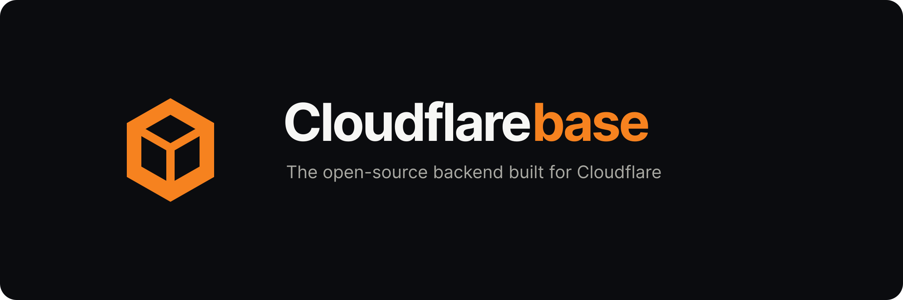

<p align="center">
  
</p>

<p align="center">
  <a href="https://cloudflarebase.com"><strong>Hosted</strong></a> ·
  <a href="https://cloudflarebase.com/dashboard">Live demo</a> ·
  <a href="#self-host">Self-host</a> ·
  <a href="CONTRIBUTING.md">Contributing</a>
</p>

<p align="center">
  <a href="LICENSE"></a>
  <a href="../../actions/workflows/quality.yaml"></a>
  <a href="../../actions/workflows/e2e.yaml"></a>
</p>

The open-source Firebase for Cloudflare. Auth, a database with live queries on
both JSON documents and typed SQL tables, and hosting — every project gets its
own Durable Objects, so one tenant's data is another's unreachable database.
Regional read replicas, export/import, and 30-day rollback come standard.

**Use it hosted at [cloudflarebase.com](https://cloudflarebase.com), or run the
whole stack on your own Cloudflare account.** Same code either way.

Auth, Database, and Hosting are live. Storage is in progress.

## Hosted

Sign up, create a project, point your app at its id:

```ts
const baseUrl = 'https://cloudflarebase.com/api/projects/<project-id>';
// auth -> `${baseUrl}/auth`   db -> `${baseUrl}/db`
```

Add your app's origin under the project's **Settings** — that list is the CSRF
allowlist, and an unlisted origin gets a 403 rather than a confusing auth error.

To host the front end too:

```bash
npm install -g @cloudflarebase/cli
cloudflarebase login
cloudflarebase init      # links this directory to a project + app
cloudflarebase deploy    # -> https://<app>.cfbase.dev
```

Or connect the GitHub repo from the Hosting page and every push deploys.
Branches serve at `<app>-<branch>.cfbase.dev`. Ceilings: 5 projects per org, 5
branches per project, 2 apps.

## Self-host

```bash
git clone https://github.com/cloudflarebase/cloudflarebase.git
cd cloudflarebase && npm install
npm run dev          # localhost:5173/dashboard — no secrets, demo mode on
```

Deploy the whole stack, in dependency order:

```bash
npx wrangler login
npm run deploy:all                             # one Worker per agent + the dashboard
npx wrangler secret put CONSOLE_SETUP_TOKEN    # 24+ chars — then claim the console
```

The D1 control plane provisions itself. **The setup token exists because your
URL is not a secret:** without it, ownership of a fresh install goes to whoever
loads `/login` first, and a workers.dev name is guessable. The same token later
reclaims a console you do not own.

Two optional add-ons, both off until you ask: hosted apps need Workers for
Platforms (paid — deploys 503 without it, nothing else changes), and auth-event
charts need Analytics Engine, an account toggle only the Cloudflare dashboard
can grant. Enable it, then uncomment the two lines `agents/auth/wrangler.jsonc`
shows you. Google/GitHub sign-in, email, and Sentry are likewise opt-in.

Prefer buttons? One per Worker, same order:
[auth](https://deploy.workers.cloudflare.com/?url=https://github.com/cloudflarebase/cloudflarebase/tree/main/agents/auth) ·
[db](https://deploy.workers.cloudflare.com/?url=https://github.com/cloudflarebase/cloudflarebase/tree/main/agents/db) ·
[hosting](https://deploy.workers.cloudflare.com/?url=https://github.com/cloudflarebase/cloudflarebase/tree/main/agents/hosting) ·
[dashboard](https://deploy.workers.cloudflare.com/?url=https://github.com/cloudflarebase/cloudflarebase)

## Add the agents to a Worker you already have

The console is optional — each agent is a normal npm package:

```bash
cloudflarebase init my-backend   # scaffolds a Worker with auth
cd my-backend
cloudflarebase add db            # documents + SQL tables, live queries on both
cloudflarebase deploy
```

`add` merges the agent's wrangler config into yours without overwriting
anything you set, exports the Durable Object classes from your entrypoint, and
adds a type assertion so a missing binding fails at compile time with its name.

## Use it from your app

Auth is Better Auth, so its client works unmodified:

```ts
const authClient = createAuthClient({ baseURL: `${baseUrl}/auth` });
await authClient.signUp.email({ name, email, password });
```

Browsers get a cookie; everything else uses the `set-auth-token` bearer. That
signed-in user's token is what the database verifies — there is no ambient API
key, and none is needed.

**Documents** need no schema; a collection exists the moment you write to it:

```ts
const db = createDbClient({ baseUrl: `${baseUrl}/db`, getToken });

const posts = db.collection('posts');
await posts.create({ title: 'Hello', votes: 1 });
await posts.query({ orderBy: [{ field: 'votes', direction: 'desc' }], limit: 25 });
```

**Tables** are schema-first: declare typed columns once, then the same handle
returns typed rows. `cloudflarebase schema generate` emits a drizzle schema
from them, and `@cloudflarebase/db/drizzle` runs real SQL:

```ts
const sql = drizzleTable({ baseUrl: `${baseUrl}/db`, table: 'todos', getToken });
await sql.select().from(todos).orderBy(desc(todos.created_at));
```

**One table per statement.** Each table is its own Durable Object — its own
10 GB, its own thread, its own regional replicas — so SQL is single-table by
design: `WHERE`/`ORDER BY`/`LIMIT`, aggregates, subqueries, self-joins and CTEs
yes; DDL no (columns are declared, never `CREATE TABLE`).

**Joins across tables are a view.** Declare 2–5 member tables and a read-only
Durable Object follows their change logs into one SQLite, where a plain SELECT
can join them:

```ts
await fetch(`${baseUrl}/db/views/library/sql`, {
	method: 'POST',
	headers: { authorization: `Bearer ${token}` },
	body: JSON.stringify({
		sql: 'SELECT b.title, a.name FROM books b JOIN authors a ON a.id = b.author_id'
	})
});
```

Writes stay on the member tables. A view is read-only and eventually consistent
(~3s behind) — built for reporting reads, not for invariants.

**Realtime** is a `subscribe` on any collection or table query: a snapshot,
then added/modified/removed deltas as writes land, all multiplexed over one
WebSocket per client. Windowed queries handle displacement correctly.

```ts
posts.subscribe(
	{ orderBy: [{ field: 'votes', direction: 'desc' }], limit: 25 },
	{ onSnapshot: render, onChange: (change, docs) => render(docs) }
);
```

**On a server**, your users' own tokens are still the credential — an SSR route
relays the session the user already sent it. For a cron, queue consumer, or
webhook with no user to relay, mint a **service key** under Settings: scoped to
one project, admin-grade on its data, and refused outright from any request
carrying an `Origin`, so it cannot work in frontend code even by accident.

Reads serve from a replica in the reader's region (session bookmarks keep
read-your-writes), and every collection and table can be exported, imported, or
rolled back to any point in the past 30 days. Each project serves its own
OpenAPI document at `/api/projects/<id>/openapi.json`.

## Checks

```bash
npm run check   # svelte-check
npm run lint    # prettier + eslint
npm test        # Playwright against real workerd
```

## Security

Report vulnerabilities privately via [SECURITY.md](SECURITY.md). Keep
`DEMO_MODE` unset anywhere real users live.

## License

[Apache-2.0](LICENSE). Cloudflarebase is an independent project, not affiliated
with or endorsed by Cloudflare, Inc. See [NOTICE](NOTICE).
